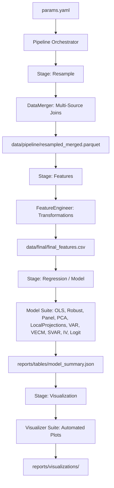

# Architecture: `stats-transformer`

A modular, configuration-driven library for macroeconomic data analysis. The `Pipeline` orchestrator separates stage logic from concrete implementations: each stage reads from the previous stage's persisted artifact and writes its own.

## Stage flow



Stages may also be invoked individually for iterative work and DVC caching. See `pipeline-stages.md` for the per-stage contract.

## Component tree

```
Pipeline                       (src/stats_transformer/pipeline.py:15)
├── DataLayer
│   ├── DataLoader             (FeatureEngineer.load_data)
│   └── DataMerger             (src/stats_transformer/featurization/data_merger.py:8)
├── FeatureLayer
│   ├── FeatureEngineer        (src/stats_transformer/featurization/feature_engineering.py:14)
│   │   ├── Transformations    (log, lag, lead, zscore, changepct, rollingmean)
│   │   └── Resampling         (annual/quarterly/monthly/daily alignment)
│   └── EventStudyBuilder      (src/stats_transformer/featurization/event_study.py)
├── ModelLayer
│   ├── ModelBase              (src/stats_transformer/models/base.py:10)
│   ├── RegressionModel        (src/stats_transformer/models/regression/regression.py)
│   ├── RobustOLSModel         (src/stats_transformer/models/regression/robust_ols.py)
│   ├── PanelRegressionModel   (src/stats_transformer/models/regression/panel.py)
│   ├── IVModel                (src/stats_transformer/models/regression/iv.py)
│   ├── PCAModel               (src/stats_transformer/models/unsupervised/unsupervised.py)
│   ├── KMeansModel            (src/stats_transformer/models/unsupervised/unsupervised.py)
│   ├── LocalProjectionsModel  (src/stats_transformer/models/timeseries/local_projections.py)
│   ├── VARModel               (src/stats_transformer/models/timeseries/var.py)
│   ├── VECMModel              (src/stats_transformer/models/timeseries/vecm.py)
│   ├── SVARModel              (src/stats_transformer/models/timeseries/svar.py)
│   └── LogitModel             (src/stats_transformer/models/discrete/logit.py)
└── VizLayer
    ├── BaseVisualizer         (src/stats_transformer/visualization/base.py)
    ├── RegressionVisualizer   (src/stats_transformer/visualization/models/regression_viz.py)
    ├── ModelVisualizer        (src/stats_transformer/visualization/models/model_viz.py)
    ├── DataVisualizer         (src/stats_transformer/visualization/eda/data_viz.py)
    ├── EDAVisualizer          (src/stats_transformer/visualization/eda/eda.py)
    ├── Standalone Charts      (src/stats_transformer/visualization/charts/)
    │   ├── CoefficientBarChart, GroupedBarChart, StackedBarChart
    │   ├── TimeSeriesPlot, IRFPlot, FacetedTimeSeries
    │   ├── BinnedScatterPlot, ScatterWithRegression
    │   └── CorrelationHeatmap
    ├── TableGenerator         (src/stats_transformer/visualization/tables/)
    └── Defaults/Formatters/Utils (visualization/{defaults,formatters,utils}/)
```

## Configuration center

`references/configs/<name>.yaml` is the single source of truth. The `Pipeline` re-reads it on every `run()` call (`src/stats_transformer/pipeline.py:198`), so editing the YAML and re-running a stage does not require re-instantiating the orchestrator.

## Data lifecycle (cookie-cutter layout)

- `data/raw/` — immutable original data dumps.
- `data/pipeline/` — `resampled_merged.parquet` intermediate produced by the `resample` stage.
- `data/final/` — featurized panel produced by the `features` stage.
- `data/temp/` — scratch space for tests and debugging (e.g. `data/temp/test_summary.json` in `references/configs/test_pipeline.yaml:13`).

## Public API

Everything re-exported from `src/stats_transformer/__init__.py:8` is part of the stable surface. New public symbols should be added there. Internal modules under `src/stats_transformer/<area>/` may change freely.
