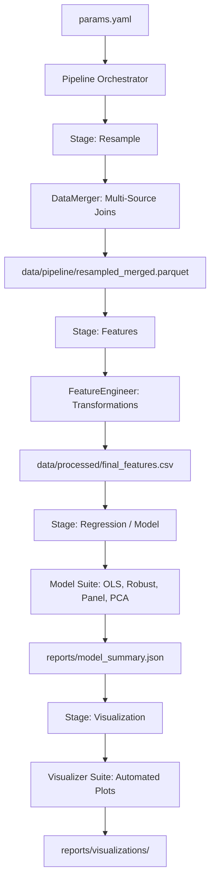
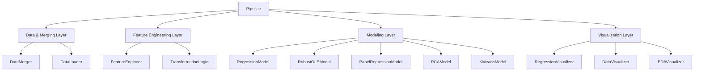

# System Architecture

`stats-transformer` is a modular, configuration-driven library designed for macroeconomic data analysis. It follows a decoupled architecture where the orchestration logic is separated from specific transformation and modeling implementations.

## 1. High-Level Logic Flow

The library operates through a sequence of well-defined stages, orchestrated by the `Pipeline` class. The flow is strictly data-dependent, ensuring that each stage receives properly formatted input from its predecessor.



## 2. Component Tree (Architecture Tree)

The system is organized into a hierarchical tree of specialized components. The `Pipeline` acts as the root, delegating specific tasks to leaf modules.



## 3. Core Components

### Pipeline Orchestrator (`src/stats_transformer/pipeline.py`)
The central entry point. It reads `params.yaml` and initializes the necessary components. It manages the execution state and ensures data persistence between stages.

### Feature Engineer (`src/stats_transformer/featurization/feature_engineering.py`)
Handles the heavy lifting of macroeconomic transformations.
*   **Time-Series Logic**: Lagging, leading, and forward differencing.
*   **Resampling**: Frequency alignment (e.g., Annual to Monthly) with configurable interpolation.
*   **Vectorized Ops**: Log-levels, Z-scores, and percentage changes.

### Data Merger (`src/stats_transformer/featurization/data_merger.py`)
Specialized for panel data. It ensures that disparate datasets with different frequencies are aligned on `entity` and `date` before modeling.

### Model Suite (`src/stats_transformer/models/`)
A standardized interface for all statistical models. Whether running a simple OLS or a complex Panel Regression with Fixed Effects, the interface remains consistent (`fit`, `predict`, `get_model_metadata`).

### Visualization Suite (`src/stats_transformer/visualization/`)
Automated reporting tools that consume model metadata and processed data to produce publication-quality plots (Coefficient plots, Residual tracking, Time-series dashboards).

## 4. Project Directory Tree

The project follows the Cookie Cutter Data Science convention to maintain a clean separation between code, data, and outputs.

```text
.
├── data/
│   ├── raw/           # Immutable original data
│   ├── pipeline/      # Intermediate merged artifacts (DVC tracked)
│   ├── processed/     # Final feature-engineered datasets
│   └── temp/          # Temporary scratch space
├── docs/              # Architectural and user documentation
├── models/            # Serialized model artifacts
├── references/        # Configuration and dictionaries
├── reports/           # Generated plots and JSON summaries
└── src/
    └── stats_transformer/
        ├── data/          # Built-in datasets
        ├── featurization/ # Transformation logic
        ├── models/        # Econometric and ML models
        ├── utils/         # Shared helpers
        ├── visualization/ # Plotting utilities
        └── pipeline.py    # Main orchestrator
```

## 5. Configuration-Driven Design

The entire behavior of the system is governed by `params.yaml`. This allows researchers to:
1.  Swap datasets without changing code.
2.  Modify transformation chains (e.g., changing a lag to a lead) via YAML.
3.  Configure model parameters and visualization styles in one central location.
4.  Ensure full reproducibility of the econometric results.
