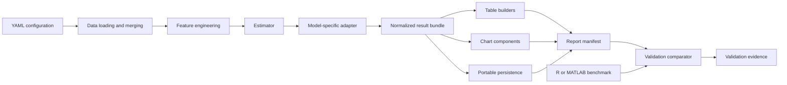
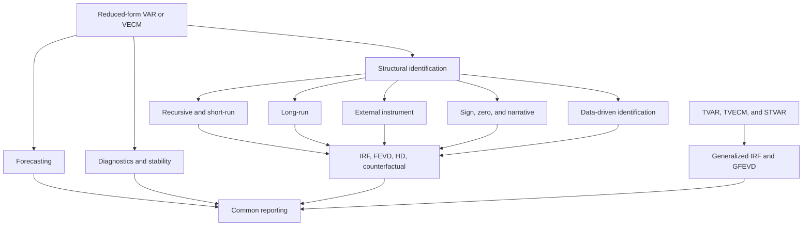

# Frequentist multivariate time-series extension roadmap

**Status:** proposed implementation plan  
**Scope:** frequentist and set-identified VAR-family models, diagnostics, forecasting, reporting, and reproducible validation  
**Explicit deferral:** Bayesian VAR, Bayesian SVAR, posterior simulation, time-varying-parameter stochastic-volatility models, and Bayesian model comparison

This document proposes an incremental extension of `stats-transformer`. The goal is not to reproduce every function in every R or MATLAB package. The goal is to provide a coherent, open-source Python workflow that connects data preparation, econometric estimation, diagnostics, structural analysis, figures, tables, and validation.

The project should be easier to use as an integrated workflow than assembling separate calls to lower-level Python libraries. It should still expose assumptions, intermediate results, and diagnostics expected in academic work. Convenience must not hide identification choices or replace numerical validation.

## Contents

1. [Objectives and boundaries](#1-objectives-and-boundaries)
2. [Current baseline](#2-current-baseline)
3. [Reference projects](#3-reference-projects)
4. [Design principles](#4-design-principles)
5. [Proposed package structure](#5-proposed-package-structure)
6. [Execution and reporting architecture](#6-execution-and-reporting-architecture)
7. [Normalized result contracts](#7-normalized-result-contracts)
8. [Model extensions](#8-model-extensions)
9. [Figures to reproduce](#9-figures-to-reproduce)
10. [Tables to reproduce](#10-tables-to-reproduce)
11. [Validation datasets and comparators](#11-validation-datasets-and-comparators)
12. [Implementation phases](#12-implementation-phases)
13. [Testing and acceptance criteria](#13-testing-and-acceptance-criteria)
14. [Dependencies and compatibility](#14-dependencies-and-compatibility)
15. [Risks and controls](#15-risks-and-controls)
16. [Issue and milestone breakdown](#16-issue-and-milestone-breakdown)
17. [Definition of done](#17-definition-of-done)
18. [Deferred Bayesian scope](#18-deferred-bayesian-scope)

## 1. Objectives and boundaries

### 1.1 Objectives

The extension should:

1. Cover the frequentist VAR workflow from lag selection through publication-ready output.
2. Treat featurization and econometric estimation as one reproducible workflow.
3. Normalize model results so that new estimators inherit common figures, tables, persistence, and validation tools.
4. Extend structural identification beyond recursive and long-run examples without overstating statistical coverage.
5. Add nonlinear multivariate models in an ordered sequence, beginning with threshold VAR.
6. Validate numerical results against independent R or MATLAB implementations under matched settings.
7. Keep R and MATLAB optional. The installed Python package and its default test suite must not require proprietary software or an R installation.
8. Produce portable artifacts in CSV, Parquet, JSON, PDF, SVG, and PNG rather than Python pickles.

### 1.2 User-facing position

The appropriate academic claim is:

> `stats-transformer` provides an integrated Python workflow for feature construction, model estimation, diagnostics, structural analysis, and reporting. It builds on the scientific Python ecosystem while reducing the glue code normally required to move from transformed data to reproducible econometric outputs.

The project may also state that Python is free and open source and can therefore lower access and reproducibility barriers relative to proprietary MATLAB workflows. It should not claim blanket superiority over MATLAB, `statsmodels`, or `linearmodels`. Those libraries remain important computational foundations and comparison points.

### 1.3 Non-goals for this roadmap

The following are deliberately out of scope:

- Bayesian priors and posterior samplers
- Bayesian VAR and Bayesian SVAR estimation
- time-varying-parameter VARs with stochastic volatility
- high-dimensional or large-N VAR estimators (e.g., LASSO/Ridge regularized VARs)
- Markov-chain Monte Carlo convergence diagnostics
- probabilistic programming dependencies such as PyMC, NumPyro, or Stan
- exact API cloning of R or MATLAB projects
- copying GPL-licensed implementation code into this project
- automatic causal interpretation without explicit identification assumptions

## 2. Current baseline

The table records capabilities already present in the repository. “Partial” means that a class or prototype exists but does not yet provide the complete estimation, inference, reporting, and validation workflow associated with the reference package.

| Capability | Current component | Coverage | Required next step |
| --- | --- | --- | --- |
| Reduced-form VAR | `VARModel` | Present | Add a lag-selection table, restrictions, forecast reporting, and full diagnostic workflow. |
| VECM | `VECMModel` | Present | Add rank-selection reporting, deterministic-term documentation, forecasts, and VECM diagnostics. |
| Short-run SVAR | `SVARModel` | Partial | Audit A, B, and AB restriction semantics, identification conditions, normalization, and inference. |
| Long-run SVAR | `BlanchardQuahModel` | Present for the defined example | Generalize reporting while retaining the verified MATLAB comparison. |
| External-instrument SVAR | `ProxySVARModel` | Present | Add weak-instrument diagnostics, normalization options, inference, and complete reporting. |
| Sign restrictions | `SignRestrictionsSVARModel` | Prototype | Replace the single-vector prototype with a restriction specification covering variables, shocks, horizons, signs, and zeros. |
| Local projections | `LocalProjectionsModel` | Present | Normalize results and expose common IRF reporting. |
| Instrumented local projections | `LocalProjectionsIVModel` | Present | Add first-stage reporting and common IRF reporting. |
| FEVD and historical decomposition | `TimeSeriesDecompositions` | Present | Standardize dimensions, reconstruction checks, tables, and charts. |
| Stationarity diagnostics | diagnostics utilities | Present | Consolidate result schemas and reporting. |
| Granger causality | `GrangerCausalityTester` | Present | Add tidy output and multiple-testing documentation. |
| Time-series feature construction | `FeatureEngineer` | Present | Document transformation provenance in model reports. |
| Common VAR reporting | reporting work in progress | Partial | Stabilize public contracts before adding new estimators. |
| Threshold and smooth-transition models | none | Absent | Implement only after linear-model and reporting foundations are stable. |
| Data-driven SVAR identification | none | Absent | Introduce method by method with independent benchmarks. |

The existing Blanchard--Quah comparator is the strongest cross-language result currently documented. It compares a defined impact matrix with MATLAB VAR-Toolbox under matched data and settings. It does not establish parity for every VAR, SVAR, or plotting function.

## 3. Reference projects

These projects define useful capability and output benchmarks. They are references for behavior, terminology, examples, and validation. They are not sources to copy.

| Project | Official source | Relevant capabilities | Intended use in this roadmap |
| --- | --- | --- | --- |
| R `vars` | [CRAN reference manual](https://stat.ethz.ch/CRAN/web/packages/vars/refman/vars.html) and [function index](https://search.r-project.org/CRAN/refmans/vars/html/00Index.html) | VAR estimation, lag selection, restrictions, prediction, residual tests, roots, stability, SVAR, SVEC, IRF, FEVD, and plotting | Primary benchmark for the complete frequentist linear VAR workflow. |
| R `tsDyn` | [CRAN package page](https://mirror.uned.ac.cr/cran/web/packages/tsDyn/index.html) and [function index](https://search.r-project.org/CRAN/refmans/tsDyn/html/00Index.html) | TVAR, TVECM, TAR, STAR, nonlinear tests, forecasts, and regime plots | Primary threshold-model reference. |
| R `svars` | [package overview](https://search.r-project.org/CRAN/refmans/svars/html/svars.html) and [function index](https://search.r-project.org/CRAN/refmans/svars/html/00Index.html) | Identification through changes in volatility, covariance, non-Gaussianity, GARCH, and smooth-transition variance; bootstrap; IRF; FEVD; historical decomposition; counterfactuals | Capability and numerical benchmark for data-driven frequentist structural identification. |
| R `sstvars` | [CRAN function index](https://search.r-project.org/CRAN/refmans/sstvars/html/00Index.html) | Structural and smooth-transition VARs, generalized IRFs, generalized FEVD, diagnostics, forecasts, and plots | Later reference for smooth-transition estimation and nonlinear responses. |
| R `VARsignR` | [GitHub repository](https://github.com/chrstdanne/VARsignR) | Sign-restriction algorithms, rejection and penalty approaches, QR rotations, and median-target summaries | Historical algorithm and output reference only. The package is Bayesian and is not a parity target. |
| R `bsvarSIGNs` | [package documentation](https://search.r-project.org/CRAN/refmans/bsvarSIGNs/html/bsvarSIGNs-package.html), [function index](https://search.r-project.org/CRAN/refmans/bsvarSIGNs/html/00Index.html), and [project site](https://bsvars.org/bsvarSIGNs/) | Sign, zero, and narrative restriction semantics; structural shocks; historical decompositions; horizon-specific restrictions | Reference for restriction specification and examples only. Posterior estimation is outside scope. |
| MATLAB VAR-Toolbox | Local source at `/Users/cory/Desktop/github_interesting/VAR-Toolbox` | VAR, SVAR, LP, IRF, FEVD, historical-decomposition, coefficient-table, and summary-statistic workflows | Cross-language numerical comparator and presentation benchmark. |
| Python `statsmodels` | [Vector autoregressions documentation](https://www.statsmodels.org/stable/vector_ar.html) | Reduced-form VAR, VECM, SVAR, forecasts, causality, and related statistical primitives | Computational dependency and Python-level comparison point. |
| Python `linearmodels` | [Project documentation](https://bashtage.github.io/linearmodels/) | Panel and instrumental-variable models | Existing dependency and comparison point outside the core VAR extension. |

### 3.1 Licensing rule

Algorithms must be implemented independently from papers and mathematical definitions. GPL R source must not be translated line by line into the MIT-licensed Python package. R and MATLAB outputs may be used as independent numerical benchmarks.

### 3.2 Dataset rule

Example datasets from R packages are useful validation anchors, but redistribution rights must be reviewed dataset by dataset. Until licensing is confirmed, comparator scripts should load datasets through the installed R package and export only local benchmark artifacts. The Python package must not silently download test data.

## 4. Design principles

### 4.1 Separation of responsibilities

Each layer should have one responsibility:

- A model estimates an econometric object.
- An adapter converts model-specific output into a normalized result.
- A table builder converts normalized results into tidy data frames.
- A chart component renders one statistical view.
- A visualizer applies names, styles, and save behavior.
- A reporter orchestrates a complete output bundle.
- A comparator checks a named statistic against an independent implementation.

### 4.2 Composition over inheritance

Shared behavior should be assembled through helper objects. A flat abstract contract may define an adapter or chart interface, but estimators should not be forced into a deep common class hierarchy. The same fitted model should be usable without a reporter, and the same reporter should accept several compatible model families.

### 4.3 Explicit assumptions

Every result bundle should record:

- variable order
- lag order
- deterministic terms
- sample start and end
- observations used
- missing-value policy
- feature transformations
- identification method
- shock order and normalization
- bootstrap or confidence-interval method
- random seed when simulation is used
- software versions

### 4.4 Stable result dimensions

Numerical arrays are ambiguous without named dimensions. Public results should use tidy data frames or explicit axis metadata. An IRF must identify response, shock, horizon, estimate, interval level, and bound. A historical decomposition must identify time, response, contribution source, and reconstructed value.

### 4.5 Incremental migration

The current modules must not be moved in one breaking change. New subpackages should be introduced behind compatibility re-exports. Existing import paths should remain supported for at least one release cycle and emit a documented deprecation warning before removal.

## 5. Proposed package structure

The target tree separates estimation domains without duplicating cross-model reporting. Directories should be created only as each phase supplies enough related files to justify them.

```text
src/stats_transformer/
├── models/
│   └── timeseries/
│       ├── reduced_form/
│       │   ├── var.py
│       │   ├── vecm.py
│       │   ├── lag_selection.py
│       │   ├── forecasting.py
│       │   └── restrictions.py
│       ├── identification/
│       │   ├── recursive.py
│       │   ├── long_run.py
│       │   ├── external_instrument.py
│       │   ├── sign_zero.py
│       │   ├── narrative.py
│       │   ├── volatility.py
│       │   └── independence.py
│       ├── nonlinear/
│       │   ├── threshold_var.py
│       │   ├── threshold_vecm.py
│       │   ├── smooth_transition_var.py
│       │   └── generalized_irf.py
│       ├── diagnostics/
│       │   ├── residuals.py
│       │   ├── stability.py
│       │   ├── stationarity.py
│       │   └── causality.py
│       ├── analysis/
│       │   ├── impulse_response.py
│       │   ├── decompositions.py
│       │   └── counterfactual.py
│       └── utilities.py
├── reporting/
│   └── timeseries/
│       ├── adapters.py
│       ├── results.py
│       ├── persistence.py
│       └── reporter.py
├── visualization/
│   ├── charts/
│   │   └── timeseries/
│   │       ├── impulse_response.py
│   │       ├── decomposition.py
│   │       ├── forecast.py
│   │       ├── diagnostics.py
│   │       └── nonlinear.py
│   ├── models/
│   │   └── timeseries_viz.py
│   └── tables/
│       └── timeseries.py
└── validation/
    └── timeseries/
        ├── comparator.py
        ├── manifests.py
        └── tolerances.py

examples/
└── timeseries/
    ├── linear_var_workflow.py
    ├── structural_identification.py
    ├── threshold_var_workflow.py
    └── cross_language_validation.py

references/configs/
├── timeseries_reporting.yaml
├── structural_restrictions.yaml
└── validation_tolerances.yaml

tests/
├── test_models/
│   └── test_timeseries/
├── test_reporting/
├── test_visualization/
└── test_validation/
```

The first implementation phase should preserve the current flat files and introduce only the `reporting/timeseries` contracts. Model reorganization should occur in small, separately reviewed changes after compatibility imports are in place.

## 6. Execution and reporting architecture

### 6.1 End-to-end workflow

A unified `Pipeline` API (similar to `scikit-learn` pipelines) should orchestrate this flow, tracking transformations to inverse-transform results where needed.



### 6.2 Model-family structure



### 6.3 Configuration boundary

YAML should describe reproducible choices, not serialize Python objects. A structural-restriction configuration should be readable without inspecting code. A conceptual schema is:

```yaml
identification:
  method: sign_zero
  normalization: positive_diagonal
  draws: 10000
  seed: 1847
  restrictions:
    - shock: supply
      response: output_growth
      horizons: [0, 1, 2, 3]
      sign: positive
    - shock: supply
      response: inflation
      horizons: [0, 1, 2, 3]
      sign: negative
    - shock: demand
      response: output_growth
      horizons: [0]
      zero: true
```

This is illustrative. A final schema requires validation rules and documented behavior for overlapping or infeasible restrictions.

## 7. Normalized result contracts

The following contracts should be defined before new model families are added.

### 7.1 Specification

| Field | Purpose |
| --- | --- |
| `model_family` | Stable family name such as `var`, `vecm`, `svar`, `tvar`, or `stvar`. |
| `variables` | Ordered endogenous-variable names. |
| `exogenous_variables` | Ordered exogenous-variable names, if any. |
| `lag_order` | Selected or supplied lag order. |
| `deterministic_terms` | Constant, trend, seasonal, or cointegration-term convention. |
| `sample_start`, `sample_end` | Estimation sample boundaries. |
| `nobs` | Number of usable observations. |
| `transformations` | Feature-engineering operations applied before estimation. |
| `identification` | Method, restrictions, shock names, and normalization. |
| `software` | Package and comparator versions. |

### 7.2 Core tabular results

| Result | Required columns or dimensions |
| --- | --- |
| Coefficients | equation, term, estimate, standard error, statistic, p-value, interval bounds |
| Forecasts | time, variable, horizon, estimate, interval level, lower, upper |
| IRFs | response, shock, horizon, estimate, interval level, lower, upper |
| FEVD | response, shock, horizon, share |
| Historical decomposition | time, response, contribution, value |
| Structural shocks | time, shock, value |
| Diagnostics | test, equation or system, statistic, degrees of freedom, p-value, conclusion |
| Stability | root, real part, imaginary part, modulus, stable |
| Regimes | time, regime, probability, classification |
| Restriction audit | draw, shock, response, horizon, rule, value, accepted |

### 7.3 Internal Data Structures

Before tabular formatting or plotting, normalized multi-dimensional results (such as IRFs, which span responses, shocks, horizons, and bounds) should be stored internally as `xarray.Dataset` or `xarray.DataArray` objects to preserve named dimensions natively.

### 7.4 Invariants

The contracts must support automated checks:

- FEVD shares sum to one within tolerance for every response and horizon.
- Historical contributions plus deterministic and initial-condition terms reconstruct the observed series within tolerance.
- stable VAR roots satisfy the documented convention.
- confidence bounds are ordered.
- accepted sign and zero restrictions satisfy the configured rules within tolerance.
- regime probabilities sum to one.
- forecasts and responses preserve the declared variable order.

## 8. Model extensions

### 8.1 Linear frequentist VAR parity

This is the first modeling target because later structural methods depend on a reliable reduced form.

| Component | Deliverable | Acceptance evidence |
| --- | --- | --- |
| Lag selection | AIC, HQ, SC/BIC, and FPE across a declared lag range | Match R `vars::VARselect` on a fixed dataset and deterministic-term convention. |
| Restricted VAR | Equation-level coefficient restrictions with an explicit mask | Match unrestricted results when the mask permits every coefficient; compare a fixed restricted case with R. |
| Forecasting | Point forecasts and analytic intervals | Match `statsmodels` and R within declared tolerances. |
| Forecast evaluation | RMSE, MAE, and optional rolling-origin evaluation | Unit tests with hand-calculated data and a documented split. |
| Residual serial correlation | Portmanteau and adjusted Portmanteau tests | Compare test statistics and degrees-of-freedom conventions with R. |
| Normality | System and component skewness/kurtosis tests | Compare a fixed benchmark and document finite-sample choices. |
| ARCH effects | Multivariate ARCH-LM workflow | Compare a fixed benchmark and document lag construction. |
| Stability | companion roots and stability diagnostics | Root invariants and R comparison. |
| Parameter stability | OLS-CUSUM or an explicitly named alternative | Compare critical-bound conventions and plot structure. |
| SVEC | Short-run and long-run restrictions in a cointegrated system | Synthetic recovery tests plus an R benchmark. |

### 8.2 Structural restriction engine

The current sign-restriction prototype should be replaced by composable restrictions.

Required capabilities:

1. Multiple named shocks.
2. Restrictions on multiple response variables.
3. Restrictions at arbitrary horizons.
4. Positive, negative, zero, and unrestricted cells.
5. Shock normalization and sign normalization.
6. Orthogonal rotations with deterministic seeds.
7. Acceptance diagnostics and infeasibility reporting.
8. Summaries that distinguish pointwise quantiles from an admissible representative draw.
9. Bootstrap uncertainty conditional on a frequentist reduced-form estimator.
10. Optional narrative constraints on dated structural shocks or historical contributions.

This phase is a frequentist or set-identified workflow. It is not intended to reproduce the posterior distributions of `VARsignR` or `bsvarSIGNs`.

### 8.3 Data-driven structural identification

The methods in R `svars` are not interchangeable helper functions. Each needs its own assumptions, optimization, normalization, inference, and comparator.

Recommended order:

1. **Changes in volatility:** begin with known variance regimes because the identifying variation and benchmark can be stated clearly.
2. **Distance covariance:** add independence-based identification with multi-start optimization and permutation-aware comparison.
3. **Cramér-von Mises:** add only after a shared independence-optimization framework is stable.
4. **Non-Gaussian maximum likelihood:** add explicit distributional choices, convergence diagnostics, and robust initialization.
5. **GARCH identification:** make `arch` an optional dependency and require convergence and persistence diagnostics.
6. **Smooth-transition variance:** defer until the nonlinear transition-function infrastructure exists.

Every method must address:

- permutation and sign indeterminacy
- scaling and unit-variance conventions
- local optima and multiple initializations
- structural-matrix invertibility
- bootstrap inference
- reproducible random seeds
- failure messages that preserve optimizer diagnostics

### 8.4 Nonlinear multivariate models

Implement nonlinear models after linear reporting and validation are stable.

| Order | Model | Minimum first release | Deferred refinements |
| --- | --- | --- | --- |
| 1 | TVAR | Two regimes, one threshold variable, grid-search threshold, regime-specific coefficients, forecasts, regime plot | Three regimes, multiple thresholds, advanced threshold tests |
| 2 | TVECM | Two regimes, explicit cointegration vector handling, threshold search, regime diagnostics | Joint rank and threshold selection |
| 3 | STVAR | One logistic transition function, bounded optimization, regime weights, forecasts | Multiple transition functions and structural variants |
| 4 | GIRF | Simulation-based generalized responses with reproducible draws | State-dependent FEVD and advanced uncertainty decompositions |

Threshold estimation must trim regimes to prevent nearly empty subsamples. Optimization results must expose convergence status, objective values, candidate thresholds, and sensitivity to starting values.

### 8.5 Counterfactual analysis

Counterfactuals should be added after structural shocks and historical decomposition share a stable result contract. The first implementation should allow named shocks to be zeroed or replaced over a specified interval, then report the baseline, counterfactual, and difference. It must not imply that an arbitrary reduced-form residual is a policy intervention.

## 9. Figures to reproduce

“Reproduce” means reproduce the statistical content and usability of the reference output with an original Python implementation and project visual style. Pixel-level cloning is neither required nor desirable.

| Figure | Reference | Required content | Acceptance criteria |
| --- | --- | --- | --- |
| Multi-panel IRF | MATLAB `VARirplot.m`; R `vars::plot.irf` | Response-by-shock grid, zero line, point estimate, one or two uncertainty bands, common horizon | Correct panel mapping, deterministic labels, ordered bands, and export to SVG/PDF/PNG. |
| Local-projection IRF | MATLAB `LPirplot.m` | Horizon response, confidence band, zero line, method annotation | Same normalized IRF contract as VAR with estimator named in metadata. |
| FEVD area chart | MATLAB `VARvdplot.m`; R `vars::plot.fevd` | Stacked shock shares by response and horizon | Shares sum to one; stable legend and shock order. |
| Historical decomposition | MATLAB `VARhdplot.m`; R `svars::hd` plotting | Stacked structural contributions, observed or reconstructed line, optional residual term | Reconstruction error reported and tested. |
| Forecast fan chart | R `vars` forecast plots | History, point forecast, nested intervals, forecast boundary | Intervals ordered and sourced from the forecast result contract. |
| Companion roots | R `vars::roots` workflow | Complex roots against the unit circle | Axis ratio fixed; stability convention stated in caption or metadata. |
| Stability and CUSUM | R `vars::stability` | Process path, critical bounds, equation selection | Bound source and confidence level exposed. |
| Residual diagnostics | R `vars` diagnostic workflow | Residual time series, autocorrelation, distribution view, test summary | Plots use the same residual sample as the reported tests. |
| Structural-shock plot | R `svars`; `bsvarSIGNs` | Named shock series with event markers | Shock normalization and dates recorded. |
| Restriction heatmap | `bsvarSIGNs` restriction semantics | Response-by-shock cells across selectable horizons | Positive, negative, zero, and unrestricted states visually distinct and accessible. |
| Accepted-response swathe | Sign-restriction literature and `VARsignR` | Accepted IRF draws, pointwise bands, optional representative draw | Representative draw is an actual admissible draw and is labeled as such. |
| Narrative timeline | `bsvarSIGNs` narrative restrictions | Events, shock signs or bounds, and accepted dates | Each annotation links to a machine-readable restriction record. |
| Counterfactual path | R `svars` counterfactual workflow | Observed, baseline reconstruction, counterfactual, and difference | Modified shocks and interval named in the figure metadata. |
| TVAR regime plot | R `tsDyn` | Threshold variable, threshold line, regime classification | Classification agrees with estimator output. |
| Threshold objective profile | R `tsDyn` diagnostics | Candidate threshold against objective value | Selected threshold and trimming region shown. |
| STVAR transition plot | R `sstvars` | Transition variable and regime weight or transition function | Weights remain in the valid range and match stored results. |
| GIRF distribution | R `sstvars` | State-dependent response summaries with simulation intervals | Seed, state, history-conditioning rule, and draw count recorded. |

All figures should accept a normalized result object, an optional Matplotlib axis, a style configuration, and a save target. Chart components should not fit models. They must integrate with the repository's three-level component-based visualization architecture (`Chart` primitives) and bundled academic styles.

## 10. Tables to reproduce

| Table | Reference | Minimum columns | Export |
| --- | --- | --- | --- |
| Model specification | MATLAB print workflows; R summaries | model, variables, sample, observations, lags, deterministic terms, transformations, identification | DataFrame, CSV, Parquet, LaTeX |
| Lag selection | R `vars::VARselect` | lag, AIC, HQ, SC/BIC, FPE, selected flags | DataFrame, CSV, LaTeX |
| Equation coefficients | MATLAB `VARprint.m`; R `summary.varest` | equation, term, estimate, standard error, statistic, p-value, interval | DataFrame, CSV, LaTeX |
| Residual covariance and correlation | MATLAB summary utilities | variable pairs, covariance or correlation | DataFrame, CSV, LaTeX |
| Diagnostic tests | R `serial.test`, `normality.test`, `arch.test` | test, scope, lag, statistic, degrees of freedom, p-value | DataFrame, CSV, LaTeX |
| Roots and stability | R `vars::roots` | root, real, imaginary, modulus, stable | DataFrame, CSV |
| Forecasts | R `predict.varest` | time, variable, horizon, estimate, lower, upper, level | DataFrame, CSV, Parquet |
| Forecast accuracy | Common forecasting practice | split, variable, horizon, metric, value | DataFrame, CSV, LaTeX |
| IRF | MATLAB and R IRF outputs | response, shock, horizon, estimate, lower, upper, level | DataFrame, CSV, Parquet |
| FEVD | MATLAB and R FEVD outputs | response, shock, horizon, share | DataFrame, CSV, Parquet |
| Historical decomposition | MATLAB and R HD outputs | time, response, contribution, value | DataFrame, CSV, Parquet |
| Identification matrix | SVAR and `svars` summaries | row variable, column shock, estimate, uncertainty, normalization | DataFrame, CSV, LaTeX |
| Restriction audit | Proposed | draw, shock, response, horizon, rule, target, value, accepted | DataFrame, Parquet |
| Regime summary | R `tsDyn` and `sstvars` | regime, observations, share, coefficient summary, variance | DataFrame, CSV, LaTeX |
| Bootstrap summary | R `svars` workflow | object, response, shock, horizon, estimate, lower, upper, replications, seed | DataFrame, Parquet |
| Numerical comparison | Existing MATLAB comparator | implementation, object, shape, tolerance, maximum absolute difference, pass | JSON, CSV, Markdown |

The LaTeX export should provide escaped labels, configurable decimal precision, optional significance markers, and a plain `tabular` body suitable for inclusion in Overleaf. Statistical decisions must remain available numerically and not exist only as formatted strings.

## 11. Validation datasets and comparators

### 11.1 Proposed benchmark matrix

| Source | Dataset or example | Purpose | Redistribution posture |
| --- | --- | --- | --- |
| R `vars` | `Canada` | Lag selection, VAR estimation, forecasts, diagnostics, roots, IRF, and FEVD | Load through R comparator until dataset licensing is documented. |
| R `svars` | `USA` or `LN` | Data-driven identification, bootstrap, FEVD, HD, and counterfactuals | Load through R comparator until licensing is documented. |
| R `tsDyn` | `barry` and selected package vignette examples | TVAR and TVECM estimation and regime behavior | Use opt-in R comparator; record package version. |
| R `sstvars` | `usamone` or `usacpu` | STVAR, transition weights, GIRF, and diagnostics | Later optional comparator. |
| R `bsvarSIGNs` | `optimism` or `monetary` | Restriction schema and narrative-example semantics only | Do not claim posterior parity. |
| MATLAB VAR-Toolbox | Blanchard--Quah example | Long-run impact matrix | Existing documented cross-language comparator. |
| Synthetic data | Known stable VAR, restricted SVAR, TVAR, and STVAR processes | Parameter recovery, invariants, edge cases, and deterministic CI | Generate locally with fixed seeds. |

### 11.2 Comparator interface

Each comparator should declare:

- benchmark implementation and version
- dataset identity and checksum when legally stored
- sample transformations
- variable order
- missing-value handling
- lag and deterministic-term settings
- identification and normalization
- statistic being compared
- absolute and relative tolerances
- output shape
- maximum absolute and relative difference
- pass or fail

Comparator results should be saved as a small machine-readable manifest and summarized in the validation documentation.

### 11.3 Optional software and containerization

R and MATLAB checks should be separate opt-in commands. Default tests must skip them cleanly when the software is unavailable. A passing default test suite must never be described as cross-language validation.

To prevent upstream changes from breaking comparators, R-based validation should eventually be executed within fixed Docker containers pinning specific `vars`, `svars`, or `tsDyn` package versions.

## 12. Implementation phases

### Phase 0: stabilize the reporting foundation

**Purpose:** ensure that existing and future models share output infrastructure.

Deliverables:

1. Finalize normalized result objects for IRF, FEVD, historical decomposition, forecasts, diagnostics, and specifications.
2. Finish adapters for VAR, Blanchard--Quah, local projections, and LP-IV.
3. Add reporter orchestration, portable persistence, and a report manifest.
4. Add core IRF, FEVD, HD, coefficient, and specification charts or tables.
5. Document public imports and add one end-to-end notebook or example.

Exit criteria:

- Existing estimators produce the same normalized columns.
- Tables and figures do not access private model internals.
- FEVD and HD invariants pass.
- Output names and metadata are deterministic apart from an explicit run timestamp.

### Phase 1: complete the linear frequentist workflow

**Purpose:** approach practical `vars` coverage before adding specialized models.

Deliverables:

1. Lag-selection object and table.
2. Restricted VAR.
3. Forecast results, fan chart, and accuracy table.
4. Serial-correlation, normality, ARCH, roots, and stability results.
5. Diagnostic figures and consolidated diagnostic table.
6. SVAR restriction audit.
7. SVEC design and implementation only after VECM conventions are documented.
8. R `vars` comparator using the `Canada` dataset.

Exit criteria:

- A single configured workflow fits a VAR, selects lags, diagnoses it, forecasts, and produces a report bundle.
- Defined benchmark statistics match R and Python references within named tolerances.
- Deterministic-term and degrees-of-freedom conventions are documented.

### Phase 2: implement the structural restriction engine

**Purpose:** support research-usable sign, zero, and narrative restrictions without Bayesian estimation.

Deliverables:

1. YAML restriction schema and validator.
2. Multiple-shock and multiple-horizon restriction evaluation.
3. Orthogonal-rotation generator with reproducible sampling.
4. Zero-restriction handling.
5. Narrative restriction evaluation against shock paths or historical contributions.
6. Acceptance-rate diagnostics, audit table, heatmap, swathe plot, and representative-draw selection.
7. Frequentist bootstrap around the reduced form.
8. Synthetic recovery and restriction-satisfaction tests.

Exit criteria:

- Every accepted draw satisfies every configured restriction.
- Infeasible specifications fail with a precise audit.
- Repeated runs with the same seed return the same accepted draws.
- Documentation clearly states that the result is not a Bayesian posterior.

### Phase 3: add data-driven SVAR identification

**Purpose:** cover selected `svars` capabilities method by method.

Deliverables:

1. Common structural-identification result and normalization helpers.
2. Changes-in-volatility identification.
3. Distance-covariance identification.
4. Shared multi-start optimization and permutation-aware comparison.
5. Bootstrap IRF, FEVD, HD, and counterfactual reporting.
6. R `svars` comparator on one documented dataset.
7. Design reviews before adding Cramér-von Mises, non-Gaussian likelihood, GARCH, or smooth-transition variance.

Exit criteria:

- At least two distinct data-driven methods have independent numerical benchmarks.
- Optimization failures are explicit and retain diagnostic information.
- Structural matrices are compared after documented sign, scale, and permutation alignment.

### Phase 4: add nonlinear frequentist models

**Purpose:** extend from linear dynamics to regimes without mixing Bayesian scope.

Deliverables:

1. Two-regime TVAR with threshold grid search.
2. Regime summaries, threshold-profile plot, regime plot, forecasts, and diagnostics.
3. TVECM after TVAR conventions and tests are stable.
4. One-transition STVAR after a bounded optimization design review.
5. GIRF simulation and state-dependent reporting.
6. Optional R `tsDyn` and `sstvars` comparators.

Exit criteria:

- Synthetic processes recover the expected regime split within declared tolerance.
- Minimum-regime-size rules are enforced.
- Optimization convergence and sensitivity are visible to the user.
- GIRF simulations are reproducible and state definitions are explicit.

### Phase 5: release hardening

Deliverables:

1. Complete API and migration documentation.
2. Example inventory and model-capability matrix updates.
3. Performance benchmarks for bootstrap, rotations, and nonlinear optimization.
4. Validation manifests with software versions.
5. Deprecation schedule for compatibility imports.
6. Review of all public claims against available evidence.

## 13. Testing and acceptance criteria

### 13.1 Test layers

| Layer | Purpose | Examples |
| --- | --- | --- |
| Unit | Check a small formula or transformation | companion matrix, restriction predicate, lag-design matrix |
| Invariant | Check properties independent of an external package | FEVD sums, HD reconstruction, probability sums, ordered intervals |
| Synthetic recovery | Check estimator behavior under known data-generating processes | stable VAR, known volatility break, known threshold |
| Python comparison | Check shared primitives | VAR forecast or coefficient comparison with `statsmodels` |
| Cross-language comparison | Check independently implemented results | R `vars`, R `svars`, R `tsDyn`, MATLAB VAR-Toolbox |
| Execution | Confirm examples and notebooks run | configured report generation |
| Figure structure | Check statistical elements without brittle pixel matching | panel count, line and collection count, labels, horizon |
| Table schema | Check portable output contracts | column names, order, dtypes, uniqueness |

### 13.2 Numerical tolerance policy

Tolerances belong in `references/configs/validation_tolerances.yaml`. Each tolerance must be associated with a statistic and benchmark. A broad project-wide tolerance is not sufficient because optimizer-based structural matrices, closed-form VAR coefficients, and simulated GIRFs have different numerical behavior.

### 13.3 Required failure tests

Tests must cover:

- unstable fitted VAR
- singular or nearly singular residual covariance
- invalid lag order
- insufficient observations
- duplicated or unordered time index
- infeasible structural restrictions
- zero accepted rotations
- weak external instrument
- empty or undersized threshold regime
- nonlinear optimizer non-convergence
- missing optional R, MATLAB, or `arch` dependency

## 14. Dependencies and compatibility

### 14.1 Core dependencies

The preferred core remains:

- NumPy for arrays and linear algebra
- pandas for labeled results
- SciPy for optimization, statistical distributions, and matrix operations
- `statsmodels` for established frequentist primitives
- Matplotlib and Seaborn for figures

If production modules import SciPy directly, it should be declared as a direct dependency rather than relied upon transitively.

### 14.2 Optional dependencies

| Extra | Purpose | Rule |
| --- | --- | --- |
| `arch` | GARCH-based structural identification | Add only with the GARCH identification phase. |
| R installation and named packages | Cross-language validation | Development and CI option, never a runtime requirement. |
| MATLAB plus VAR-Toolbox | Proprietary cross-language validation | Local opt-in comparator only. |

No Bayesian dependency stack should be added under this roadmap.

### 14.3 Performance policy

Correctness and reproducibility come before acceleration. Vectorize restriction checks and decomposition operations first. Add parallel or compiled execution only after profiling a representative benchmark and preserving deterministic seeded behavior.

## 15. Risks and controls

| Risk | Consequence | Control |
| --- | --- | --- |
| Sign, scale, and permutation indeterminacy | Numerically equivalent structural results appear different | Canonical alignment utility and documented normalization. |
| Local optima | Data-driven or nonlinear estimates depend on initialization | Multi-start optimization, stored objective values, and sensitivity summaries. |
| Infeasible restrictions | Simulations run indefinitely or produce misleading empty results | Maximum draws, early diagnostics, explicit zero-acceptance failure. |
| Bootstrap cost | Reports become slow and difficult to test | Small deterministic test settings, configurable production replications, benchmark suite. |
| Method-specific inference | One confidence-interval implementation is incorrectly reused | Store interval method in the result and implement estimator-specific resampling. |
| Dataset licensing | Reference data is redistributed improperly | Opt-in package loaders and dataset-specific license review. |
| GPL contamination | License incompatibility | Independent implementation from mathematical sources; no translated source code. |
| API breakage during reorganization | Existing examples and users fail | Compatibility imports and staged deprecation. |
| Overclaiming parity | Documentation exceeds evidence | Statistic-specific comparator manifests and claim review. |
| Code bloat | Maintenance cost exceeds project value | Phase gates, optional extras, shared result contracts, and Bayesian deferral. |

## 16. Issue and milestone breakdown

The roadmap should be implemented as reviewable issues rather than one large pull request.

### Milestone A: common reporting

1. **REPORT:** finalize normalized result schemas.
2. **REPORT:** add portable persistence and manifest.
3. **VIZ:** add IRF, FEVD, and HD chart components.
4. **TABLE:** add specification, coefficient, IRF, FEVD, and HD tables.
5. **DOCS:** add reporting example and public API guide.

### Milestone B: linear VAR completeness

1. **MODEL:** add lag-selection results.
2. **MODEL:** add restricted VAR.
3. **MODEL:** normalize forecasts and intervals.
4. **DIAGNOSTICS:** add serial, normality, ARCH, roots, and stability outputs.
5. **VIZ:** add forecast, roots, stability, and residual figures.
6. **VALIDATION:** add R `vars` comparator.
7. **DOCS:** publish a complete linear VAR workflow.

### Milestone C: structural restrictions

1. **CONFIG:** define sign, zero, and narrative restriction schema.
2. **MODEL:** implement restriction compiler and audit.
3. **MODEL:** implement rotation sampler and representative-draw selection.
4. **INFERENCE:** add frequentist bootstrap.
5. **VIZ:** add heatmap, swathe, shock, and narrative figures.
6. **VALIDATION:** add synthetic restriction tests.
7. **DOCS:** explain identification, normalization, and non-Bayesian interpretation.

### Milestone D: data-driven identification

1. **ARCHITECTURE:** define common objective and structural-result contracts.
2. **MODEL:** implement changes-in-volatility identification.
3. **MODEL:** implement distance-covariance identification.
4. **INFERENCE:** connect bootstrap analysis.
5. **ANALYSIS:** connect IRF, FEVD, HD, and counterfactuals.
6. **VALIDATION:** add R `svars` comparator.
7. **EVAL:** decide whether later `svars` methods justify their dependencies and maintenance cost.

### Milestone E: nonlinear dynamics

1. **MODEL:** implement two-regime TVAR.
2. **VIZ:** add threshold profile and regime figures.
3. **VALIDATION:** add synthetic and R `tsDyn` comparisons.
4. **MODEL:** implement TVECM.
5. **EVAL:** review STVAR optimization design.
6. **MODEL:** implement one-transition STVAR and GIRF only after review.

## 17. Definition of done

A model family is complete only when all applicable items are satisfied:

- estimator inputs and assumptions are documented
- fitted output uses normalized, named result dimensions
- failures and optimizer diagnostics are accessible
- deterministic unit and invariant tests pass
- at least one realistic example runs
- figures and tables consume normalized results
- results persist in portable formats
- a validation statement names exactly what was compared
- external software versions and settings are recorded
- public imports and migration notes are documented
- the documentation inventory and capability table are updated

An estimator that only returns coefficients is not complete. A chart that can only read one estimator’s private attributes is not complete. A numerical comparison without matched preprocessing, ordering, restrictions, and normalization is not evidence of parity.

## 18. Deferred Bayesian scope

Bayesian functionality is intentionally left off the implementation roadmap to control dependencies, conceptual surface area, testing burden, and code volume. The following projects remain useful background references but are not coverage targets:

- `BVAR`
- `bvartools`
- `bsvars`
- `bvarsv`
- Bayesian estimation in `VARsignR`
- posterior estimation in `bsvarSIGNs`

The restriction language should avoid unnecessary assumptions that would prevent a future Bayesian backend. No posterior interface, prior object, sampler abstraction, or Bayesian dependency should be added now. A future proposal should require a separate design document, maintenance justification, benchmark strategy, and explicit approval.
