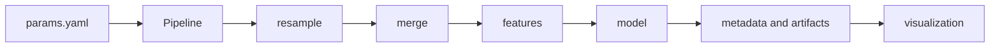
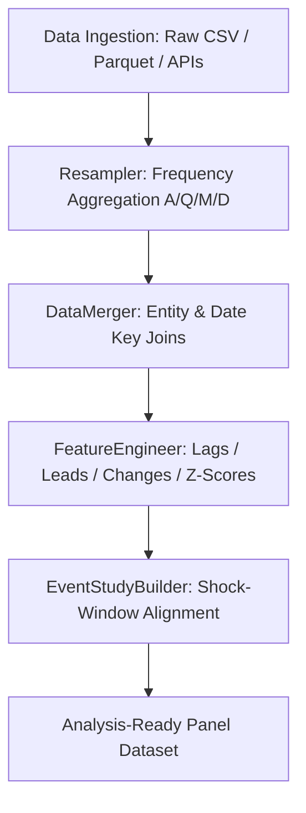
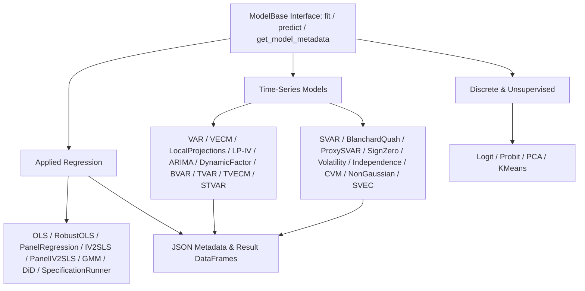
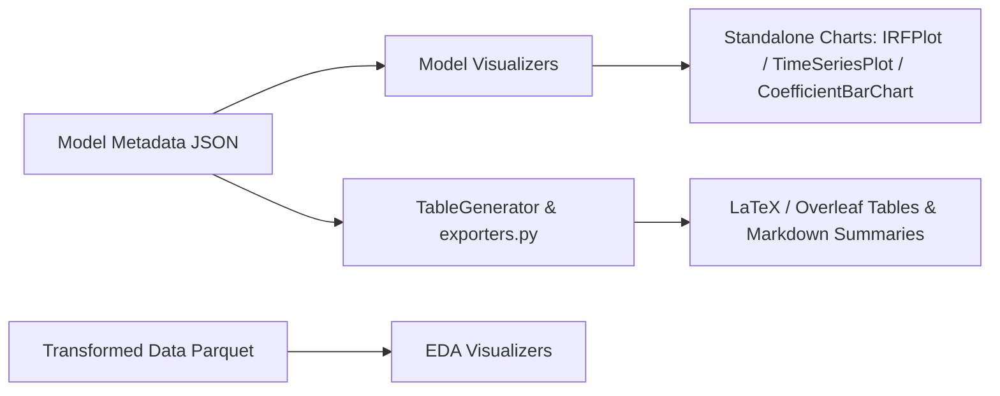

# System Architecture & Repository Structure

`stats-transformer` is a configuration-driven Python library designed for the complete empirical workflow: frequency-aware data preparation, feature construction, econometric estimation, diagnostics, and publication-ready reporting outputs. It acts as a reproducible workflow layer built upon foundational Python scientific computing packages (`numpy`, `pandas`, `statsmodels`, `linearmodels`, `scipy`).

---

## 1. Workflow Contract

For YAML-driven execution, the `Pipeline` class coordinates sequential execution stages:



- **Pipeline Stages**:
  - `resample`: Aligns multi-frequency datasets and performs panel joins via `DataMerger`.
  - `features`: Applies `FeatureEngineer` transformations within entity boundaries.
  - `regression`: Fits configured estimators and outputs structured JSON metadata.
  - `visualization`: Renders configured plots from transformed data or saved model metadata.
  - `eda`: Generates exploratory data analysis charts.
- **Stage Execution**: `Pipeline.run(stage=...)` accepts `resample`, `features`, `eda`, `regression`, `visualization`, or `None` for full sequential execution.
- **Persisted Artifacts**: Every stage persists inspectable artifacts (Parquet, CSV, JSON, figures) enabling modular inspection and caching.

---

## 2. Repository File Structure & Boundaries

The repository follows a Cookiecutter Data Science-style separation between reusable library code, empirical inputs, executable examples, tests, configurations, and generated outputs.

```text
.
├── .agents/                       # Project instructions and agent skills
├── data/
│   ├── examples/                  # Bundled and validation example datasets
│   ├── final/                     # Engineered analysis-ready panels (gitignored)
│   ├── pipeline/                  # Resampled and merged intermediate parquets (gitignored)
│   ├── raw/                       # Source raw datasets
│   └── temp/                      # Disposable local data (gitignored)
├── docs/
│   ├── library/                   # Architecture, model catalog, data guide, citations
│   ├── validation/                # Software benchmarks and test suite guides
│   ├── overview.md                # Central documentation hub
│   └── roadmap.md                 # Future model extensions roadmap
├── models/                        # Serialized model artifacts when produced
├── notebooks/                     # Exploratory interactive demonstrations
├── references/
│   ├── configs/                   # YAML specifications (params.yaml)
│   └── dictionaries/              # Constant mapping files
├── reports/
│   ├── figures/                   # Generated visual outputs
│   ├── tables/                    # Generated LaTeX and markdown tables
│   └── visualizations/            # EDA and model visualizations
├── src/
│   ├── examples/                  # Executable demonstrations and benchmark scripts
│   ├── stats_transformer/         # Installable Python package
│   └── temp/                      # Disposable development scripts
└── tests/
    ├── data/                      # Stable test fixtures
    ├── integration/               # Multi-language integration tests (R, Stata)
    ├── verification/              # Opt-in external verification (MATLAB)
    └── test_*.py                  # Automated unit and integration tests
```

---

## 3. Package Architecture & Core Components

```text
src/stats_transformer/
├── __init__.py                    # Public API re-exports
├── pipeline.py                    # YAML-driven orchestration
├── data/                          # Packaged datasets and example loader
├── featurization/
│   ├── feature_engineering.py     # Transformations and resampling
│   ├── data_merger.py             # Multi-source panel joins
│   └── event_study.py             # Event-study window construction
├── models/
│   ├── base.py                    # Common ModelBase contract
│   ├── registry.py                # Model registry and YAML dispatcher
│   ├── regression/                # OLS, Robust OLS, Panel OLS, IV, Panel IV, GMM, DiD, SpecRunner
│   ├── timeseries/                # VAR, VECM, SVAR, LP, ARIMA, Dynamic Factor, BVAR, Nonlinear, Diagnostics
│   ├── discrete/                  # Logit, Probit
│   └── unsupervised/              # PCA, KMeans
├── reporting/                     # Result exporters and table generation
├── utils/                         # Configuration and shared utilities
└── visualization/
    ├── charts/                    # Reusable chart components (IRFPlot, TimeSeriesPlot, etc.)
    ├── eda/                       # Exploratory visualizers
    ├── models/                    # Model and regression visualizers
    ├── tables/                    # TableGenerator
    └── defaults/                  # Styles, palettes, labels, formatters
```

---

## 4. Component Details & Subsystem Diagrams

### 4.1 Data Ingestion & Feature Engineering Flow



- **`FeatureEngineer`**: Applies transformations within entity boundaries across annual (A), quarterly (Q), monthly (M), and daily (D) frequencies. Operations include log levels, changes, percentage changes, lags, leads, rolling means, and z-scores.
- **`DataMerger`**: Executes panel joins across multiple data sources using explicit entity and date keys.
- **`EventStudyBuilder`**: Constructs normalized event-window panels around shock dates.

---

### 4.2 Econometric Estimators & Base Hierarchy



- **Unified Base Contract (`ModelBase`)**: Every model implements the `ModelBase` abstract contract (`fit`, `predict`, `get_model_metadata`).
- **Normalized Outputs**: All estimators return normalized DataFrames and structured JSON metadata containing coefficients, standard errors, $t$-statistics, $p$-values, covariance matrices, and model diagnostic metrics.
- **Complete Reference**: For full mathematical specifications, access aliases, and benchmark comparisons for all 30 implemented model classes, see the [Implemented Models Catalog](models.md).

---

### 4.3 Visualization & Reporting Flow



- **Modular Chart Components (`src/stats_transformer/visualization/charts/`)**: Standalone, composable plotting classes (`IRFPlot`, `TimeSeriesPlot`, `CoefficientBarChart`, `FacetedTimeSeries`, `BinnedScatterPlot`, `CorrelationHeatmap`).
- **Reporting & Exporters (`src/stats_transformer/reporting/`)**: Publication-ready LaTeX and Markdown table generation via `TableGenerator` and metrics persistence via `exporters.py`.

---

## 5. Configuration & Reproducibility Boundaries

- `references/configs/`: The control center for reproducible specifications. Configurations select raw data, transformation settings, model choices, and output directories.
- `reports/`: Stores output figures, LaTeX tables, and JSON metadata.
- Source datasets remain unmodified. The pipeline writes intermediate and final artifacts to `data/pipeline/` and `data/final/`.

---

## 6. Related Documentation

- [Documentation overview](../overview.md)
- [Implemented models catalog](models.md)
- [Data directory guide](data.md)
- [Academic citations](citations.md)
- [Cross-language software benchmarks](../validation/benchmarks.md)
- [Testing suite](../validation/testing_suite.md)
- [Future model roadmap](../roadmap.md)
