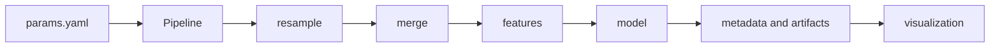

# System architecture

`stats-transformer` is a configuration-driven Python library for the full empirical workflow: frequency-aware data preparation, feature construction, econometric estimation, diagnostics, and publication-oriented outputs. It is a workflow layer built on established Python estimators such as `statsmodels` and `linearmodels`; it does not claim to replace their estimator-specific interfaces.

## Contents

1. [Workflow contract](#workflow-contract)
2. [Package tree](#package-tree)
3. [Core components](#core-components)
4. [Configuration boundary](#configuration-boundary)
5. [Agent-facing architectural guidance](#agent-facing-architectural-guidance)
6. [Related documentation](#related-documentation)

## Workflow contract

For YAML-driven runs, `Pipeline` coordinates the following stages:



`Pipeline.run(stage=...)` accepts `resample`, `features`, `eda`, `regression`, `visualization`, or no stage for the complete configured workflow. Each stage can persist an inspectable artifact, including merged data, engineered features, JSON model metadata, and figures.

The `resample` stage aligns configured data sources and merges them through `DataMerger`. The `features` stage applies `FeatureEngineer` transformations. The `regression` stage fits the configured model and records metadata. The `visualization` stage renders configured outputs from the transformed data or saved model metadata.

## Package tree

```text
src/stats_transformer/
├── __init__.py                    # public API re-exports
├── pipeline.py                    # YAML-driven orchestration
├── data/                          # packaged datasets and panel construction
├── featurization/
│   ├── feature_engineering.py     # transformations and resampling
│   ├── data_merger.py             # multi-source joins
│   └── event_study.py             # event-study data construction
├── models/
│   ├── base.py                    # common model contract
│   ├── regression/                # OLS, robust OLS, panel OLS, IV
│   ├── timeseries/                # VAR, VECM, SVAR, LP, identification, diagnostics
│   ├── discrete/                  # logit
│   └── unsupervised/              # PCA and K-means
├── reporting/                     # result exporters
├── utils/                         # configuration and shared helpers
└── visualization/
    ├── charts/                    # reusable chart components, including IRFPlot
    ├── eda/                       # exploratory visualizers
    ├── models/                    # model and regression visualizers
    ├── tables/                    # table generation
    └── defaults/                  # styles, colors, labels, and formatters
```

The repository also contains `src/examples/` for executable demonstrations and `tests/` for automated checks. Examples are not part of the installable package contract.

## Core components

### Data and features

`FeatureEngineer` works with an entity column and date column to apply transformations within entities. Supported operations include log levels, raw and percentage changes, lags, leads, rolling means, z-scores, forward log differences, and resampling across annual, quarterly, monthly, and daily data.

`DataMerger` combines data sources on explicit entity and date keys. The stage artifacts make it possible to inspect alignment and feature choices before estimation.

### Model contract

`ModelBase` supplies the shared `fit`, `predict`, and `get_model_metadata` interface. Model metadata is designed to be JSON serializable and includes configured parameters, metrics, summary fields, and coefficients when the underlying estimator exposes them.

Model families include OLS, robust OLS, panel OLS, IV, logit, PCA, K-means, VAR, VECM, SVAR, local projections, Blanchard--Quah long-run identification, proxy SVAR, sign restrictions, LP-IV, and time-series decomposition utilities. The [documentation overview](../overview.md#3-library-model-inventory) identifies which are currently available through the YAML dispatcher and which are direct-use classes or utilities.

Not every direct model class is currently selected through the YAML `Pipeline` dispatcher. The current dispatcher supports `ols`, `robust_ols`, `panel_ols`, `pca`, `kmeans`, `blanchard_quah`, `proxy_svar`, `sign_restrictions`, and `lp_iv`. Direct class construction remains the supported interface for VAR, VECM, SVAR, IV 2SLS, logit, local projections, and the time-series utilities.

### Visualization and reporting

`visualization/charts/` contains reusable plotting primitives such as `CoefficientBarChart`, `TimeSeriesPlot`, `IRFPlot`, `FacetedTimeSeries`, `BinnedScatterPlot`, and `CorrelationHeatmap`. Higher-level visualizers consume pipeline outputs, while `reporting/exporters.py` converts result structures to portable formats.

## Configuration boundary

The repository keeps reusable code separate from empirical specifications:

- `references/configs/` stores YAML examples and reusable specifications.
- `data/` stores raw, intermediate, final, and example data.
- `reports/` stores generated figures, tables, and model outputs.
- `src/examples/academic/` holds replication-oriented demonstrations.

This boundary is intentional. A change to data sources, feature definitions, model selection, or output paths should ordinarily begin in configuration. A new estimator, transformation, or chart belongs in the corresponding package module and requires tests.

## Agent-facing architectural guidance

The optional `stats-transformer-architecture` skill in `.agents/skills/` and `.codex/skills/` is a concise machine-readable map of this architecture. It identifies stage contracts, extension points, public APIs, and model-specific routing. It supports compatible coding agents during maintenance, but it does not replace tests, numerical validation, or human review.

## Related documentation

- [Repository structure](file_structure.md)
- [Testing suite](../validation/testing_suite.md)
- [Academic and numerical validation](../validation/academic_examples.md)
- [MATLAB cross-language comparator](../validation/matlab_comparator.md)
