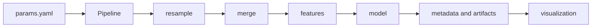
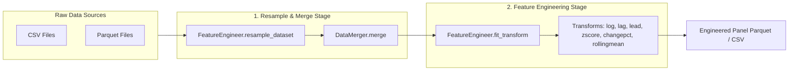
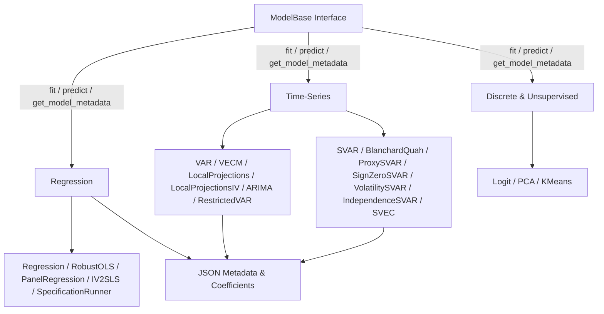
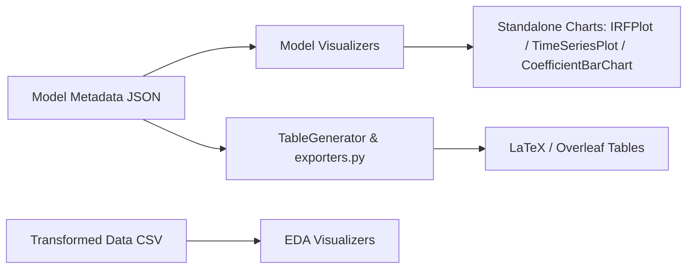

# System architecture

`stats-transformer` is a configuration-driven Python library for the full empirical workflow: frequency-aware data preparation, feature construction, econometric estimation, diagnostics, and publication-oriented outputs. It is a workflow layer built on established Python estimators such as `statsmodels` and `linearmodels`; it does not replace their estimator-specific interfaces.

## Table of Contents

1. [1. Workflow contract](#1-workflow-contract)
2. [2. Package tree](#2-package-tree)
3. [3. Core components](#3-core-components)
   - [3.1 Data and Feature Engineering](#31-data-and-feature-engineering)
   - [3.2 Econometric Estimators & Base Interface](#32-econometric-estimators--base-interface)
   - [3.3 Visualization and Reporting](#33-visualization-and-reporting)
4. [4. Configuration boundary](#4-configuration-boundary)
5. [5. Agent-facing architectural guidance](#5-agent-facing-architectural-guidance)
6. [6. Related documentation](#6-related-documentation)

---

## 1. Workflow contract

For YAML-driven runs, `Pipeline` coordinates the following stages:



- `Pipeline.run(stage=...)` accepts `resample`, `features`, `eda`, `regression`, `visualization`, or `None` for full runs.
- Each stage persists inspectable artifacts including merged parquets, engineered CSVs, JSON model metadata, and figures.
- Stage breakdown:
  - `resample`: Aligns configured data sources and performs joins via `DataMerger`.
  - `features`: Applies `FeatureEngineer` transformations within entity boundaries.
  - `regression`: Fits configured estimators and outputs structured JSON metadata.
  - `visualization`: Renders configured plots from transformed data or saved model metadata.

---

## 2. Package tree

```text
src/stats_transformer/
├── __init__.py                    # public API re-exports
├── pipeline.py                    # YAML-driven orchestration
├── data/                          # packaged datasets and panel construction
├── featurization/
│   ├── feature_engineering.py     # transformations and resampling
│   ├── data_merger.py             # multi-source joins
│   └── event_study.py             # event-study data construction
├── models/
│   ├── base.py                    # common model contract
│   ├── regression/                # OLS, robust OLS, panel OLS, IV, spec runner
│   ├── timeseries/                # VAR, VECM, SVAR, LP, ARIMA, identification, diagnostics
│   ├── discrete/                  # logit
│   └── unsupervised/              # PCA and K-means
├── reporting/                     # result exporters
├── utils/                         # configuration and shared helpers
└── visualization/
    ├── charts/                    # reusable chart components, including IRFPlot
    ├── eda/                       # exploratory visualizers
    ├── models/                    # model and regression visualizers
    ├── tables/                    # table generation
    └── defaults/                  # styles, colors, labels, and formatters
```

---

## 3. Core components

### 3.1 Data and Feature Engineering

#### Data Flow Diagram



#### Key Capabilities

- **`FeatureEngineer`**: Applies transformations within entity boundaries across annual (A), quarterly (Q), monthly (M), and daily (D) frequencies. Supported operations: log levels, raw and percentage changes, lags, leads, rolling means, z-scores, and forward differences.
- **`DataMerger`**: Executes panel joins across multiple data sources using explicit entity and date keys.
- **`EventStudyBuilder`**: Constructs normalized event-window datasets around discrete shock dates.

---

### 3.2 Econometric Estimators & Base Interface

#### Estimator Hierarchy Diagram



#### Complete Model Subsystem Matrix

| Family | Class Name | Description | Access Mode |
| --- | --- | --- | --- |
| **Regression** | `RegressionModel` | OLS regression with intercept or entity fixed effects | Pipeline: `ols`; Direct API |
| **Regression** | `RobustOLSModel` | Heteroskedasticity/autocorrelation robust OLS (HC/HAC) | Pipeline: `robust_ols`; Direct API |
| **Regression** | `PanelRegressionModel` | Entity & time fixed effects panel regression | Pipeline: `panel_ols`; Direct API |
| **Regression** | `IV2SLSModel` | 2-Stage Least Squares instrumental variables regression | Direct API |
| **Regression** | `SpecificationRunner` | Multi-specification regression runner utility | Direct API |
| **Time Series** | `VARModel` | Reduced-form OLS Vector Autoregression | Direct API |
| **Time Series** | `VECMModel` | Johansen Cointegrated Vector Error Correction Model | Direct API |
| **Time Series** | `RestrictedVAR` | Reduced-form VAR with equation-level coefficient masks | Direct API |
| **Time Series** | `ARIMAModel` | Univariate Autoregressive Integrated Moving Average | Direct API |
| **Time Series** | `SVARModel` | Structural VAR under short-run linear restrictions | Direct API |
| **Time Series** | `BlanchardQuahModel` | Long-run structural VAR identification (Blanchard-Quah) | Pipeline: `blanchard_quah`; Direct API |
| **Time Series** | `ProxySVARModel` | External-instrument structural VAR identification | Pipeline: `proxy_svar`; Direct API |
| **Time Series** | `SignZeroSVARModel` | Sign & zero restriction structural VAR identification | Pipeline: `sign_restrictions`; Direct API |
| **Time Series** | `VolatilitySVARModel` | Changes-in-volatility heteroskedastic structural VAR | Direct API |
| **Time Series** | `IndependenceSVARModel` | Distance covariance / ICA data-driven structural VAR | Direct API |
| **Time Series** | `SVEC` | Structural VECM combining cointegration with restrictions | Direct API — *Planned* (ML estimation not yet implemented) |
| **Time Series** | `LocalProjectionsModel` | Jordà (2005) horizon-by-horizon local projections | Pipeline: `local_projections`; Direct API |
| **Time Series** | `DynamicFactorModel` | EM-estimated dynamic factor model (Kalman filter/smoother) | Pipeline: `dynamic_factor`; Direct API |
| **Time Series** | `LocalProjectionsIVModel` | Instrumented local projections (Stock & Watson 2018) | Pipeline: `lp_iv`; Direct API |
| **Discrete** | `LogitModel` | Binary logit maximum-likelihood classification | Pipeline: `logit`; Direct API |
| **Discrete** | `ProbitModel` | Binary probit maximum-likelihood classification | Pipeline: `probit`; Direct API |
| **Unsupervised** | `PCAModel` | Principal Component Analysis feature extraction | Pipeline: `pca`; Direct API |
| **Unsupervised** | `KMeansModel` | K-means clustering algorithm | Pipeline: `kmeans`; Direct API |
| **Diagnostics & Utils** | `GrangerCausalityTester` | Pairwise & system Granger causality testing | Direct Utility API |
| **Diagnostics & Utils** | `ResidualDiagnostics` | Portmanteau autocorrelation, Jarque-Bera, ARCH-LM | Direct Utility API |
| **Diagnostics & Utils** | `StabilityDiagnostics` | Companion matrix eigenvalue roots & stability plot | Direct Utility API |
| **Diagnostics & Utils** | `StationarityDiagnostics` | ADF and KPSS unit-root stationarity tests | Direct Utility API |
| **Diagnostics & Utils** | `VARLagSelector` | Information criteria lag selection (AIC, HQ, SC, FPE) | Direct Utility API |
| **Diagnostics & Utils** | `VARForecaster` | Point forecasting and analytic error bounds | Direct Utility API |
| **Diagnostics & Utils** | `ForecastEvaluator` | RMSE and MAE forecast error evaluation | Direct Utility API |
| **Diagnostics & Utils** | `TimeSeriesDecompositions` | Historical and forecast error variance decompositions | Direct Utility API |

#### Access Modes: Pipeline Supported vs Direct API

- **Pipeline Supported (YAML Dispatcher)**: The automated `Pipeline` orchestrator reads a `params.yaml` configuration file and routes the execution via `model.model_type` (e.g. `model_type: ols`, `robust_ols`, `panel_ols`, `pca`, `kmeans`, `blanchard_quah`, `proxy_svar`, `sign_restrictions`, `local_projections`, `lp_iv`, `dynamic_factor`). This allows non-programmatic, reproducible execution across full pipeline stages (`resample` -> `features` -> `regression` -> `visualization`).
- **Direct API Usage**: Specialized estimators and diagnostic utilities (such as `VARModel`, `VECMModel`, `SVARModel`, `VolatilitySVARModel`, `IndependenceSVARModel`, `ARIMAModel`, `IV2SLSModel`, `LogitModel`, `GrangerCausalityTester`) can be instantiated directly as Python classes (`model = VARModel(...)`). Direct API usage provides full control over estimation parameters, custom matrix masks, and advanced structural identification loops.

---

### 3.3 Visualization and Reporting

#### Reporting Flow Diagram



#### Key Capabilities

- **Modular Chart Components (`src/stats_transformer/visualization/charts/`)**:
  - `IRFPlot`: Multi-panel impulse response curves with confidence intervals.
  - `TimeSeriesPlot`: Time series tracking with custom shading and overlays.
  - `CoefficientBarChart`: Model coefficient comparisons with error bars.
  - `FacetedTimeSeries`, `BinnedScatterPlot`, `CorrelationHeatmap`.
- **Reporting & Exporters (`src/stats_transformer/reporting/`)**:
  - `TableGenerator`: Generates publication-ready LaTeX and Markdown summary tables.
  - `exporters.py`: Persists execution metrics and transformed DataFrames.

---

## 4. Configuration boundary

The repository maintains strict separation between reusable library code and empirical specifications:

- `references/configs/`: Stores YAML specification files (`params.yaml`).
- `data/`: Holds raw, intermediate, final, and example datasets. See [Data directory guide](data.md) for full dataset catalog and layout.
- `reports/`: Stores output figures, LaTeX tables, and JSON metadata.
- `src/examples/academic/`: Contains runnable paper replication scripts.

---

## 5. Agent-facing architectural guidance

The repository includes an agent skill at `.agents/skills/stats-transformer-architecture/` providing machine-readable guidance for coding agents. It details pipeline contracts, extension points, public re-exports, and file routing patterns.

---

## 6. Related documentation

- [Repository structure](file_structure.md)
- [Data directory guide](data.md)
- [Academic Citations](citations.md)
- [Testing suite](../validation/testing_suite.md)
- [Academic & numerical validation](../validation/validation.md)
