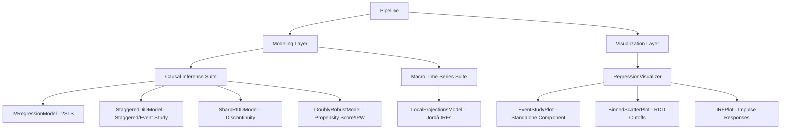

# Proposed Econometric Model Extensions: Causal Inference & Macroeconomic Time Series

This document outlines a roadmap for expanding the statistical and econometric capabilities of the `stats-transformer` library. By cross-referencing our current [System Architecture](../library/architecture.md) (which relies on OLS, Robust OLS, Panel Regression, and unsupervised models) with adjacent repositories in the research ecosystem, we identify several critical gaps and propose a systematic plan to integrate them into our modular, configuration-driven structure.

---

## 🗺️ Current vs. Proposed Modeling Capabilities

Our current model layer is designed for standard multivariate and panel estimation. To transition `stats-transformer` into a robust causal inference and advanced macroeconomic framework, we propose adding three missing suites:

| Current Architecture (`architecture.md`) | Proposed Additions (Causal & Time-Series Suite) | Core Ecosystem Inspiration | Primary Academic / Empirical Application |
| :--- | :--- | :--- | :--- |
| **OLS Regression** | **Instrumental Variables (IV-2SLS)** | `Econometrics-Agent` | Estimating treatment effects with endogenous regressors. |
| **Robust OLS Regression** | **Staggered Diff-in-Diff (TWFE / Event Study)** | `Econometrics-Agent` | Policy evaluation with variation in treatment timing. |
| **Panel Regression (FE/RE)** | **Regression Discontinuity Design (RDD)** | `Econometrics-Agent` | Causal inference around strict administrative cutoffs. |
| **PCA & KMeans Models** | **Propensity Score Matching & Double Robust** | `Econometrics-Agent` | Selection bias mitigation in observational studies. |
| *(None)* | **Local Projections (Jordà LP)** | `reproducible-econ-ai` | Macroeconomic monetary and fiscal impulse responses. |
| *(None)* | **Preflight Assumption & Diagnostics Checkers** | `aesdk` | Programmatic ex-ante verification of model assumptions. |
| *(None)* | **Provenance Auditing Ledger** | `forking-paths` | Audit trail capturing Gelman's *garden of forking paths*. |

---

## 🚀 1. The Causal Inference Modeling Suite

The largest current gap in `stats-transformer` is the complete absence of causal identification strategies. Integrating these models will align `stats-transformer` with modern empirical microeconomics.

### A. Instrumental Variables (IV-2SLS / GMM)
*   **What is missing**: The ability to handle endogeneity (measurement error, omitted variables, or reverse causality) using external instruments.
*   **Architectural Integration**: Introduce `IVRegressionModel` inheriting from the base model class. It will wrap the `linearmodels.iv.IV2SLS` backend.
*   **Statistical Preflight**: Programmatically execute weak-instrument diagnostics (Cragg-Donald and Kleibergen-Paap F-statistics) and exogeneity tests (Hausman test).

### B. Specialized Difference-in-Differences (DiD)
*   **What is missing**: Standard panel fixed effects can absorb static group and time differences, but they do not automatically structure staggered treatments or compile dynamic Event Study coefficient plots.
*   **Architectural Integration**: Create `StaggeredDiDModel` to handle treatment variation over time. It should support:
    *   Classical Two-Way Fixed Effects (TWFE) with event-study leads and lags.
    *   Modern robust estimators (e.g., Callaway & Sant'Anna 2021) that avoid negative weighting issues in staggered panels.
*   **Visualization**: Extend `RegressionVisualizer` to support `EventStudyPlot` showing pre-trends and post-treatment dynamics with confidence intervals.

### C. Regression Discontinuity Design (RDD)
*   **What is missing**: Discontinuity modeling at administrative thresholds.
*   **Architectural Integration**: Add `SharpRDDModel` and `FuzzyRDDModel`. The models will handle:
    *   Local linear regressions within optimal bandwidths (Imbens-Kalyanaraman or Calonico-Cattaneo-Titiunik selection).
    *   Fuzzy RDD global polynomial estimators.
*   **Visualization**: Add `BinnedScatterPlot` component showing local sample averages on either side of the running variable cutoff.

### D. Propensity Score & Doubly Robust Estimators
*   **What is missing**: Rebalancing observational data to estimate Average Treatment Effects (ATE).
*   **Architectural Integration**: Add `PropensityScoreEstimator` to compute propensity scores using logistic regression, and `DoublyRobustEstimator` combining inverse probability weighting (IPW) with outcome regression models.

---

## 📈 2. The Macroeconomic Time Series Suite

Given that `stats-transformer` focuses on macroeconomic panel structures (merging multi-source datasets with varying frequencies), it is missing time-series and structural macro estimation methods.

### A. Local Projections (Jordà 2005)
*   **What is missing**: The ability to trace impulse response functions (IRFs) for macroeconomic shocks without imposing the strict structural assumptions of Vector Autoregressions (VARs).
*   **Architectural Integration**: Add `LocalProjectionsModel`. It will run a series of predictive regressions at varying horizons $h$:
    $$Y_{i, t+h} = \alpha_{i, h} + \beta_h D_{i, t} + \sum_{j=1}^p \gamma_{j, h} X_{i, t-j} + \epsilon_{i, t+h}$$
*   **Visualization**: Build `IRFPlot` under standalone chart components to programmatically graph $\beta_h$ coefficients across horizons.

---

## 🛡️ 3. Methodological Governance & Process Auditing

Our current architecture implements a configuration-driven design that guarantees *state* reproducibility. However, it lacks *process* governance, leaving it vulnerable to data-mining and specification hunting.

### A. Preflight Econometric Checklists (Informed by `aesdk`)
Before executing any regression in the modeling stage, the `Pipeline` orchestrator should programmatically call an econometric validator checking:
1.  **Standard Error Alignment**: Are standard errors clustered at the correct level (e.g., state or firm level) given the panel structure?
2.  **Multicollinearity**: What is the Variance Inflation Factor (VIF) of the control variables?
3.  **Unit Root Tests**: Are the macroeconomic variables stationary (ADF/KPSS tests), and is differencing required?

### B. Provenance Auditing Ledger (Informed by `forking-paths`)
Ensure that the process of arriving at the final regression is transparent:
1.  **Commitment Gate**: Researchers pre-register their main specification in `params.yaml`.
2.  **Audit Ledger**: The pipeline writes a continuous ledger recording every single variation of controls, lags, or sample exclusions attempted.
3.  **Auditor Appendix**: Generates a markdown report logging the "garden of forking paths" to prove the final results were not selectively reported.

---

## 🧩 Architectural Integration Blueprint

To integrate these models without bloating the codebase, we will extend the `stats-transformer` component tree by nesting the new estimators under the unified `ModelLayer` interface.



### Proposed Interface Signatures
All new models will implement the existing `BaseModel` abstract class, ensuring compatibility with `Pipeline` runners:

```python
class IVRegressionModel(BaseModel):
    def fit(self, df):
        # Wraps linearmodels.iv.IV2SLS
        pass

    def predict(self, df):
        pass

    def get_model_metadata(self):
        # Returns coefficient tables, F-stats, Hausman p-values
        pass


class LocalProjectionsModel(BaseModel):
    def fit(self, df):
        # Runs multi-horizon predictive OLS regressions
        pass

    def get_model_metadata(self):
        # Returns arrays of IRF coefficients and confidence bands
        pass
```
